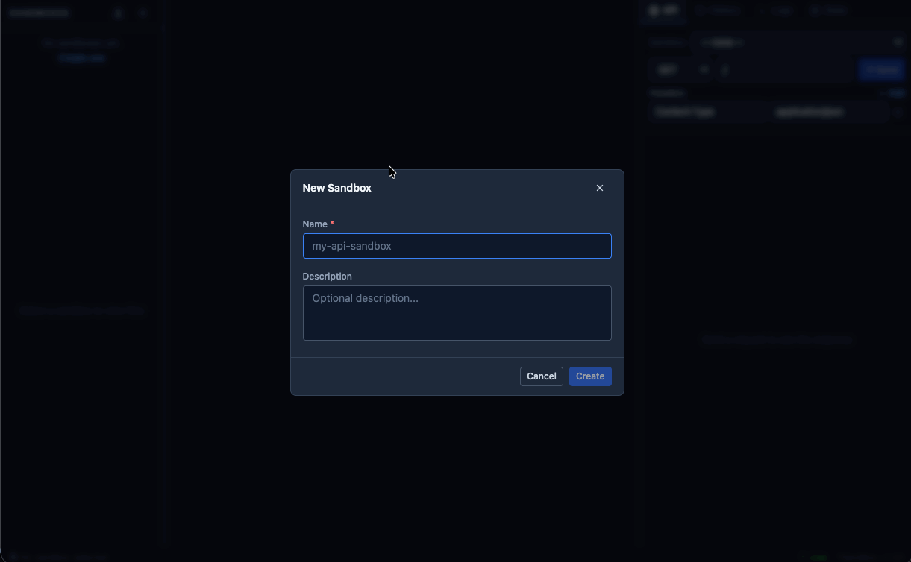

# TSandbox

[](https://github.com/khang7598/TSandbox/actions/workflows/ci.yml)
[](https://github.com/khang7598/TSandbox/releases)
[](https://github.com/khang7598/TSandbox/pkgs/container/tsandbox)
[](https://nodejs.org)

**Stop waiting. Stop writing boilerplate. Just ship.**

Tired of spinning up a fake service every time a third-party API isn't ready? Tired of hardcoding JSON fixtures that don't reflect real-world behavior? Tired of telling your team "sorry, the mock isn't updated yet"?

TSandbox fixes all of that. Write your mock API as TypeScript code — it hot-reloads in under a second, runs in a secure isolated sandbox, and your whole team shares the same live environment.

> Mock APIs as code, not static JSON.



---

## Who Is This For?

**Frontend developers** — your backend isn't ready and you can't wait. Stub it in TSandbox, keep building, swap it out when the real thing ships.

**Backend developers** — a third-party payment, auth, or notification service is flaky or missing from your dev environment. Mock it with real logic instead of hardcoding responses in your app code.

**QA engineers** — you need deterministic, controllable API behavior to test edge cases: timeouts, 500s, malformed payloads, rate limit responses. TSandbox gives you that without touching production or staging.

**Platform / DevEx teams** — you want a single shared mock server the whole org can use, version-controlled, exportable, and CI-friendly. One Docker container, one ZIP per service, done.

If you've ever written a `// TODO: replace with real API` comment — this is for you.

---

## Why TSandbox?

| Without TSandbox | With TSandbox |
|---|---|
| Spin up a mock server per service | One sandbox per service, no infra needed |
| Restart server on every code change | Hot reload — edit and it's live instantly |
| Static JSON that doesn't match reality | Real TypeScript handlers with state, latency, logic |
| "The mock doesn't support that edge case" | Add a branch in 30 seconds |
| Blocked waiting on a third-party team | Stub their API today, replace it when it's ready |
| CI breaks because mocks are out of sync | Export/import sandboxes as ZIP — portable and reproducible |

---

## How TSandbox Compares

| | TSandbox | Mockoon | WireMock | json-server | MSW |
|---|:---:|:---:|:---:|:---:|:---:|
| TypeScript handlers (real logic) | ✅ | ❌ | ❌ | ❌ | ✅ |
| Hot reload (no restart) | ✅ | ✅ | ❌ | ❌ | ✅ |
| In-browser editor (Monaco) | ✅ | ✅ | ❌ | ❌ | ❌ |
| Persistent state across requests | ✅ | ❌ | ⚠️ | ❌ | ❌ |
| OpenAPI spec import | ✅ | ✅ | ✅ | ❌ | ❌ |
| Isolated sandbox (secure execution) | ✅ | ✅ | ✅ | ❌ | ✅ |
| Portable export / import (ZIP) | ✅ | ✅ | ⚠️ | ❌ | ❌ |
| Docker-native, CI-ready | ✅ | ✅ | ✅ | ⚠️ | ❌ |
| Request history + runtime logs | ✅ | ✅ | ✅ | ❌ | ❌ |
| No cloud dependency | ✅ | ✅ | ✅ | ✅ | ✅ |

> ✅ supported &nbsp; ⚠️ partial / workaround needed &nbsp; ❌ not supported

MSW runs in the browser/Node test process — great for unit tests, but not a shared team server. WireMock is powerful but Java-based and config-heavy. json-server is dead-simple but can't handle logic. Mockoon is the closest alternative — TSandbox goes further with real TypeScript, persistent state, and a sandbox-per-service model.


## Write Mocks Like Real Code

No YAML. No config files. No DSL to learn. Just TypeScript:

```typescript
import { defineMock, ok, error, delay } from '@tsandbox/sdk'

export default defineMock({
  method: 'GET',
  path: '/orders/:id',
  description: 'Fetch an order by ID',

  async handler({ params, state }) {
    await delay(120) // simulate real latency

    state.hitCount = (state.hitCount as number ?? 0) + 1

    if (params.id === '999') {
      return error(404, { message: 'Order not found' })
    }

    return ok({
      id: params.id,
      status: 'shipped',
      total: 59.99,
      requests: state.hitCount,
    })
  },
})
```

Change the code. It's live. No restart. No rebuild.

See **[docs/GUIDE.md](./docs/GUIDE.md)** for the full SDK reference — response helpers, path patterns, flaky API simulation, persistent state, SSE stubs, and more.

---

## Import an OpenAPI Spec Instantly

Already have an OpenAPI spec? Click "Document Icon" in the Files section, paste your JSON or YAML, and TSandbox generates one ready-to-edit handler per operation.

Generated handlers include:

- **Response shapes** inferred from your spec schemas (with example values)
- **Body validation** — returns `400` automatically if required fields are missing
- **Multi-response simulation** via `?__status=<code>` — trigger any error branch without touching code:

```bash
curl "http://localhost:3001/orders?__status=422"    # trigger 422 from your spec
curl "http://localhost:3001/users/99?__status=404"  # trigger 404 from your spec
```

- **SSE stubs** for `text/event-stream` endpoints

These files are fully yours after import — edit freely, they're just a starting point.

---

## Built for Teams

**Sandboxes are portable.** Export any sandbox as a `.zip` and hand it to a teammate, commit it to a repo, or drop it into CI.

```bash
# Export
curl -o payments-mock.zip http://localhost:3001/_api/sandboxes/{id}/export

# Import on any other TSandbox instance
curl -X POST http://localhost:3001/_api/sandboxes/import \
  -F "file=@payments-mock.zip"
```

Or use the UI — hover over a sandbox in the sidebar and click the download icon.

**One sandbox per service** is the recommended pattern — keeps routes, state, and request history cleanly separated between teams.

---

## Easy to run

TSandbox also ships as a single Docker image. Drop it into your server, import a sandbox ZIP, and your integration tests have a live API to hit — no extra services, no flaky stubs.

**Just run this and you're live:**

```bash
docker run -d \
  --name tsandbox \
  --restart unless-stopped \
  -p 3001:3001 \
  -v tsandbox_data:/data \
  ghcr.io/khang7598/tsandbox:1.4.0
```

That's one command. No config files, no database setup, no dependencies to install. Open **http://localhost:3001** and start hitting your mock APIs.

Pin to a specific version tag (e.g. `1.4.0`) in CI — never get surprised by a breaking change.

See [DEPLOYMENT.md](./DEPLOYMENT.md) for Docker Compose, nginx, persistent storage, env vars, and upgrade paths.

---

## Sandbox Concepts

| Concept | What it means |
|---|---|
| **Sandbox** | An isolated environment with its own routes, state, and history. Think "one sandbox = one service you're mocking." |
| **Route** | A `.ts` file that handles one URL pattern. One file = one route. |
| **State** | A plain object that persists across requests within a sandbox. Survives hot reloads, resets on clear. Great for simulating counters, CRUD stores, session state. |
| **History** | Every request/response is recorded — full headers, body, duration. No more guessing what your client actually sent. |

---

## Performance & Security

TSandbox is built to be safe to run user code in a shared environment:

- Every handler runs in **isolated-vm** — a true V8 isolate, not `eval()` or `vm.runInContext()`
- No outbound network (`fetch`, `axios` not available inside sandboxes)
- No Node.js built-ins (`fs`, `path`, `crypto`, etc.)
- 10 second execution timeout and 128 MB memory cap per isolate
- Path traversal protection on all file and ZIP operations

And it's built to be fast:

- Hot reload completes in under a second (esbuild + in-memory registry swap)
- Route matching is O(n) with a `Map`-backed registry — no router rebuilds on edits
- Fresh V8 `Context` per request (cheap) — isolate is cached and reused across requests


---

## Contributing / Local Development

Want to hack on TSandbox itself? Here's how to get the full stack running locally.

**Prerequisites:** Node.js 22+, pnpm

```bash
git clone https://github.com/khang7598/TSandbox.git
cd TSandbox
pnpm install   # install all workspace dependencies
pnpm dev       # start backend + frontend concurrently
```

| What | URL |
|---|---|
| Frontend (React + Vite) | http://localhost:5173 |
| Backend (Fastify API) | http://localhost:3001 |

To run a single package:

```bash
pnpm --filter @tsandbox/backend dev   # backend only
pnpm --filter @tsandbox/frontend dev  # frontend only
pnpm typecheck                        # type-check all packages
pnpm build                            # production build
```

The monorepo has three packages: `packages/sdk` (mock helpers), `packages/backend` (Fastify server + runtime), `packages/frontend` (React UI). See [docs/ARCHITECTURE.md](./docs/ARCHITECTURE.md) for a deep-dive into how they fit together.

Pull requests are welcome — [open an issue](https://github.com/khang7598/TSandbox/issues) first for anything beyond a small fix.


## Like what you see?

If TSandbox saves your team time, a star helps other developers find it.

**[⭐ Star TSandbox on GitHub](https://github.com/khang7598/TSandbox)**

Found a bug or have a feature idea? [Open an issue](https://github.com/khang7598/TSandbox/issues) — contributions are welcome.

---

## Documentation

| Doc | What's inside |
|---|---|
| [docs/GUIDE.md](./docs/GUIDE.md) | Full SDK reference — `defineMock()`, response helpers, state patterns, SSE, curl examples |
| [docs/ARCHITECTURE.md](./docs/ARCHITECTURE.md) | Deep-dive into every subsystem — request flow, hot-reload pipeline, sandbox execution, compiler |
| [DEPLOYMENT.md](./DEPLOYMENT.md) | Docker, Docker Compose, nginx, env vars, persistent storage, upgrading |
| [RELEASE.md](./RELEASE.md) | Semver release process and hotfix workflow |
| [CHANGELOG.md](./CHANGELOG.md) | Version history |
