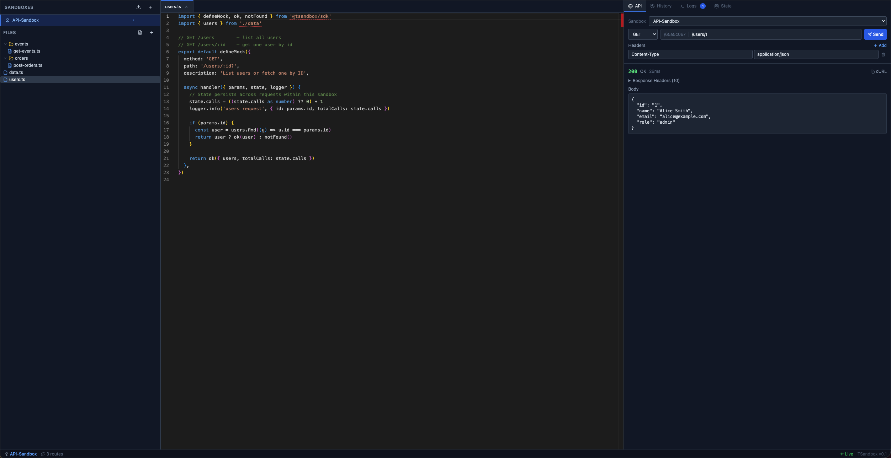

# TSandbox

[](https://github.com/khang7598/TSandbox/actions/workflows/ci.yml)
[](https://github.com/khang7598/TSandbox/releases)
[](https://github.com/khang7598/TSandbox/pkgs/container/tsandbox)
[](https://nodejs.org)

TSandbox is a programmable API sandbox platform. Instead of static JSON fixtures, you write TypeScript handlers that run live in isolated sandboxes — with hot reload, request history, runtime logs, and shared state.



---

## Getting Started

```bash
pnpm install
pnpm dev
```

Open **http://localhost:5173** in your browser.

1. Click **+** in the sidebar to create a sandbox (e.g. `payments-service`)
2. Two example files are seeded automatically: `data.ts` (shared data) and `users.ts` (a route that imports from it)
3. Edit files in the Monaco editor — changes hot-reload in under a second
4. Use the **API** tab on the right to send test requests: try `GET /users` or `GET /users/1`

---

## Sandbox Concepts

| Concept | Description |
|---|---|
| **Sandbox** | An isolated environment with its own routes, state, and history. Create one per service you want to mock. |
| **Route** | A single `.ts` file that handles one URL pattern. One file = one route. |
| **State** | A plain object that persists across requests within a sandbox. Survives hot reloads, resets on sandbox state clear. |
| **History** | Every request/response is recorded in the History tab with headers, body, and duration. |

---

## Writing Mocks

See **[docs/GUIDE.md](./docs/GUIDE.md)** for the full SDK reference:

- Mock file format and `defineMock()` structure
- File naming and shared imports
- Methods, path patterns, handler context
- Response helpers (`ok`, `error`, `sse`, `xml`, `redirect`, …)
- Simulating latency and flaky APIs
- Persistent state patterns (counter, CRUD store)
- Logging, state inspector, curl examples

---

## Importing from an OpenAPI Spec

Click the **↑** icon in the **Files** section header to import an OpenAPI 3.x spec. Paste JSON or YAML — one `defineMock()` file is generated per operation, grouped by tag or first path segment.

Generated handlers include:

- **Response shapes** inferred from the `200`/`201` response schema (with example values where provided)
- **Body validation** for operations with `required` request body fields — returns a `400` automatically if fields are missing
- **Multi-response simulation** via `?__status=<code>` — trigger any error branch defined in the spec without touching code:

```bash
curl "http://localhost:3001/orders?__status=422"   # triggers 422 branch
curl "http://localhost:3001/users/99?__status=404" # triggers 404 branch
```

- **SSE stubs** for `text/event-stream` endpoints

After import, each generated file is fully editable — treat it as a starting point, not a locked artifact.

---

## Exporting and Importing Sandboxes

Sandboxes can be exported as a `.zip` file and imported on any other TSandbox instance — the primary way to move a sandbox to a new server.

### Export

Hover over a sandbox name in the sidebar and click the **↓** (Download) icon. The browser downloads a ZIP containing all source files and a `sandbox.json` manifest.

Or via the API:

```bash
curl -o my-sandbox.zip http://localhost:3001/_api/sandboxes/{id}/export
```

### Import

Click the **↑** (Upload) icon in the **Sandboxes** header, then drop a `.zip` file into the dialog. A new sandbox is created with a fresh ID and all routes are immediately hot-reloaded.

Or via the API:

```bash
curl -X POST http://localhost:3001/_api/sandboxes/import \
  -F "file=@my-sandbox.zip"
```

**What is included:** all source `.ts` files and the sandbox name/description.  
**What is not included:** request history and in-memory state.

---

## Constraints

These are intentional security boundaries of the sandbox runtime:

- No outbound network calls (`fetch`, `axios`, etc. are not available)
- No Node.js built-ins (`fs`, `path`, `crypto`, etc.)
- No `require()` other than `@tsandbox/sdk`
- `delay()` is the only async operation supported
- SSE responses deliver all events in a single payload — true long-lived streaming is not supported
- Maximum execution time: 10 seconds per request
- Maximum memory: 128 MB per sandbox isolate

---

## Tips

- **One sandbox per service** — keeps routes, state, and history isolated between teams
- **Use `logger` not `console.log`** — output appears in the Runtime Logs panel, not the terminal
- **State survives hot reload** — you can edit a handler mid-test without losing accumulated state
- **History tab is your friend** — every request records full headers, body, and duration
- **F2 to rename** — works on files and folders in the sidebar
- **`?__status=<code>` on any request** — triggers the matching error branch in OpenAPI-imported handlers without editing code

---

## Deploying

Pre-built images are published to GitHub Container Registry on every release:

```bash
docker run -d \
  --name tsandbox \
  --restart unless-stopped \
  -p 3001:3001 \
  -v tsandbox_data:/data \
  ghcr.io/khang7598/tsandbox:latest
```

Pin to a specific version by replacing `latest` with a release tag (e.g. `1.0.0`).

See [DEPLOYMENT.md](./DEPLOYMENT.md) for docker compose setup, nginx configuration, building from source, persistent storage, upgrading, and all environment variables.
