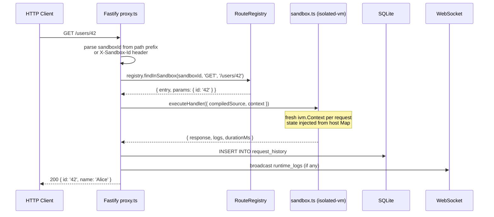
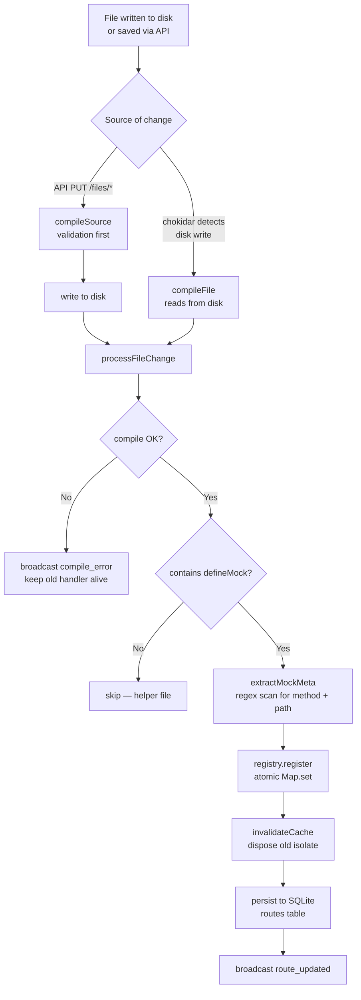

# TSandbox — Architecture Deep Dive

A study guide for understanding how TSandbox works under the hood. Each section explains not just *what* happens but *why* it was designed that way.

---

## Table of Contents

1. [System Overview](#1-system-overview)
2. [Request Lifecycle](#2-request-lifecycle)
3. [Isolated Sandbox Execution](#3-isolated-sandbox-execution)
4. [The SDK Shim Trick](#4-the-sdk-shim-trick)
5. [Compiler Pipeline](#5-compiler-pipeline)
6. [Hot-Reload Pipeline](#6-hot-reload-pipeline)
7. [Route Registry](#7-route-registry)
8. [Persistent State](#8-persistent-state)
9. [WebSocket Event Bus](#9-websocket-event-bus)
10. [OpenAPI Import](#10-openapi-import)
11. [Sandbox Export / Import](#11-sandbox-export--import)
12. [Frontend Architecture](#12-frontend-architecture)
13. [Database Schema](#13-database-schema)
14. [Key Design Decisions](#14-key-design-decisions)

---

## 1. System Overview

```
┌─────────────────────────────────────────────────────────┐
│                     Browser (port 5173)                  │
│  React + Monaco Editor + Zustand + React Query           │
│                         │ /_ws (WebSocket)               │
│                         │ /_api (REST management)        │
└─────────────────────────┼───────────────────────────────┘
                          │ proxy (Vite dev) or nginx (prod)
┌─────────────────────────┼───────────────────────────────┐
│              Fastify Server (port 3001)                  │
│                                                          │
│  ┌──────────┐  ┌──────────────┐  ┌──────────────────┐   │
│  │  proxy   │  │  management  │  │   WebSocket /_ws │   │
│  │  /*.     │  │  /_api/*     │  │                  │   │
│  └────┬─────┘  └──────────────┘  └──────────────────┘   │
│       │                                                  │
│  ┌────▼──────────────────────────────────────────────┐   │
│  │              Route Registry (in-memory Map)        │   │
│  └────┬──────────────────────────────────────────────┘   │
│       │                                                  │
│  ┌────▼──────────────────────────────────────────────┐   │
│  │          isolated-vm Sandbox (per request)         │   │
│  └────┬──────────────────────────────────────────────┘   │
│       │                                                  │
│  ┌────▼────────┐  ┌──────────────┐  ┌────────────────┐   │
│  │   SQLite DB │  │  chokidar    │  │  esbuild       │   │
│  │  (history,  │  │  (file watch)│  │  (TS compiler) │   │
│  │   routes)   │  └──────────────┘  └────────────────┘   │
│  └─────────────┘                                         │
└─────────────────────────────────────────────────────────┘
                          │
               ┌──────────▼──────────┐
               │  ~/.tsandbox/       │
               │  sandboxes/{id}/*.ts│
               │  tsandbox.db        │
               └─────────────────────┘
```

**Three processes in dev:**
- `tsx watch src/index.ts` — the Fastify backend
- `vite` — the React frontend dev server (proxies `/_api`, `/_sandbox`, `/_ws` to port 3001)
- `tsup --watch` — rebuilds the SDK package when its source changes

---

## 2. Request Lifecycle

This is the critical path. Every mock request goes through this chain:



### Sandbox ID resolution (priority order)

```
1. Path prefix:  GET /_sandbox/{sandboxId}/users/42
2. Header:       X-Sandbox-Id: {sandboxId}
3. Default:      'default'
```

This lets teams share one server but keep routes isolated — just use a different sandbox ID per service.

### What gets recorded in history

Every request — including 404s — is written to `request_history` with full headers, body, response, duration, and any logs emitted by the handler. The table is capped at `historyLimit` rows per sandbox (default 1000).

---

## 3. Isolated Sandbox Execution

This is the most security-critical part of the system. User-written TypeScript runs inside an `isolated-vm` isolate — a V8 context with no access to Node.js APIs.

### Why isolated-vm and not Node.js `vm`?

Node.js `vm` module is **not a security boundary**. Code in a `vm.Context` can escape to the host process via prototype chain exploits (`({}).constructor.constructor('return process')(...)`). `isolated-vm` creates a true V8 Isolate — a separate heap, separate globals, and no shared references unless you explicitly bridge them.

### One isolate per (sandboxId, routeId)

```
scriptCache Map:
  "sandboxId:routeId" → { isolate, script, compiledSource }
```

The `ivm.Script` (compiled bytecode) is cached and reused across requests. Only the `ivm.Context` is created fresh per request — this is cheap (microseconds) while script compilation is expensive (milliseconds).

### What gets bridged into the isolate

Only three things cross the boundary:

| Host → Isolate | Mechanism | Purpose |
|---|---|---|
| `$__ctx` | `ivm.ExternalCopy` | Request context + state |
| `$__log` | `ivm.Callback` (fire-and-forget) | `logger.*` calls |
| `$__delay` | `ivm.Callback` (async) | `delay()` implementation |

| Isolate → Host | Mechanism | Purpose |
|---|---|---|
| `$__resolve(json)` | `ivm.Callback` (sync) | Return response + mutated state |
| `$__reject(msg)` | `ivm.Callback` (sync) | Throw handler error |

Everything else — `fetch`, `fs`, `process`, `require` — does not exist inside the isolate.

### State serialisation

State is a plain object stored in a host-side `Map<sandboxId, Record<string, unknown>>`. Before each request it's deep-copied into the isolate via `ivm.ExternalCopy`. After execution, `$__resolve` sends the mutated state back as JSON and the host overwrites its copy.

This means:
- State is **not shared between concurrent requests** (each gets a snapshot)
- Only **JSON-serialisable values** survive across requests
- Mutations only persist if the handler returns successfully

---

## 4. The SDK Shim Trick

This is the clever part that makes `import { ok } from '@tsandbox/sdk'` work inside an isolated-vm with no Node.js.

### The problem

- esbuild can bundle imports, but `@tsandbox/sdk` must work inside isolated-vm
- isolated-vm has no `require()`, no module system, no Node.js
- We can't bundle the SDK into every handler file at compile time (it would bloat and duplicate)

### The solution

1. **At compile time** — esbuild marks `@tsandbox/sdk` as `external`:
   ```typescript
   external: ['@tsandbox/sdk']
   ```
   The compiled output contains `require('@tsandbox/sdk')` — unresolved.

2. **At execution time** — the sandbox script has a custom `require()` that intercepts it:
   ```javascript
   function require(id) {
     if (id === '@tsandbox/sdk') return __sdk;
     throw new Error('require() is not allowed: ' + id);
   }
   ```

3. **`__sdk`** is a plain JavaScript object defined in the preamble of every execution script, containing all the helper functions hand-ported from TypeScript to ES5:
   ```javascript
   var __sdk = {
     ok:    function(body, status) { return { status: status ?? 200, body }; },
     error: function(msg, status, ex) { ... },
     sse:   function(events) { ... },
     // ...
   };
   ```

### Key constraint

The sandbox shim uses ES5 and plain string concatenation — **no template literals, no `\n` in string literals** inside the `buildExecutionScript` template string. Template literal escape sequences apply to the entire template, so `'\n'` inside the template becomes a real newline and breaks the generated JavaScript. Use `'\\n'` to produce a literal `\n` in the output.

---

## 5. Compiler Pipeline

```
User saves file in Monaco editor
         │
         ▼
PUT /_api/sandboxes/:id/files/:path
  { content: "import { defineMock... }" }
         │
         ▼
compileSource(content, filePath)          ← compiler.ts
  esbuild.build({
    stdin: { contents: source },
    bundle: true,
    format: 'cjs',                        ← CommonJS output
    platform: 'neutral',                  ← no Node.js globals
    target: 'es2022',
    external: ['@tsandbox/sdk'],          ← replaced by shim at runtime
  })
         │
    ┌────┴────┐
  error     success
    │           │
    ▼           ▼
broadcast   write file to disk
compile_    + processFileChange()
error
```

### Why `format: 'cjs'`?

CJS uses `require()` / `exports` — both of which can be shimmed trivially in the execution script. ESM uses static `import` which can't be intercepted at runtime without a module loader.

### Why `platform: 'neutral'`?

`platform: 'node'` injects Node.js polyfills (`process`, `Buffer`, etc.) — we explicitly don't want those in the sandbox. `neutral` means "no platform assumptions."

### What esbuild does to local imports

```typescript
// routes/users.ts
import { users } from '../data'
```

esbuild resolves `../data.ts`, reads it, and inlines it into the compiled bundle. The final compiled output is a single self-contained CJS file — no filesystem access needed at runtime.

---

## 6. Hot-Reload Pipeline



### The atomic swap

`registry.register(entry)` does a single `Map.set()`. In Node.js, this is atomic — there's no window where a request could find a half-updated handler. In-flight requests using the old handler complete normally.

### Why debounce (200ms)?

Text editors write files in multiple syscall bursts. Without debouncing, a single save would trigger 3–5 compile cycles. Chokidar's debounce collapses them into one.

### The `extractMockMeta` regex

```typescript
const methodMatch = source.match(/method\s*:\s*['"`]([A-Z]+)['"`]/)
const pathMatch   = source.match(/path\s*:\s*['"`]([^'"`]+)['"`]/)
```

This is a static scan — it never executes user code to read the route metadata. It's fast and safe, but it means dynamic method/path values (e.g. `method: getMethod()`) won't be picked up correctly. The convention is: always use string literals for `method` and `path`.

---

## 7. Route Registry

```typescript
// Simplified structure
Map<sandboxId, RegistryEntry[]>

interface RegistryEntry {
  id: string          // sha256(filePath)[0:16]
  sandboxId: string
  method: string      // 'GET' | 'POST' | ... | 'ALL'
  pattern: string     // '/users/:id'
  enabled: boolean
  handler: {
    compiledSource: string
    source: string
    filePath: string
    compiledAt: number
  }
}
```

### Route ID derivation

```typescript
function filePathToRouteId(filePath: string): string {
  return crypto.createHash('sha256').update(filePath).digest('hex').slice(0, 16)
}
```

The route ID is deterministic from the file path. This means:
- Same file always gets the same ID (survives restarts)
- Renaming a file creates a new route and removes the old one
- Two files at the same path are impossible (filesystem constraint)

### Matching algorithm

`registry.find(method, pathname)` does an O(n) scan through all entries, trying `path-to-regexp` against the pathname. The first match wins — which means **file order matters** when multiple routes could match the same URL.

For sandbox-scoped requests, `findInSandbox()` filters by `sandboxId` first, then scans. The fallback `find()` checks all sandboxes — useful for the `X-Sandbox-Id` header flow.

---

## 8. Persistent State

State is sandboxed per `sandboxId` (not per route). All routes in the same sandbox share the same state object.

```
Request 1 (GET /users):
  host reads sandboxStates.get(sandboxId)  → { count: 5 }
  serialises into isolate via ExternalCopy
  handler runs: state.count = 6
  $__resolve sends back { __state: { count: 6 } }
  host writes sandboxStates.set(sandboxId, { count: 6 })

Request 2 (POST /orders):
  host reads sandboxStates.get(sandboxId)  → { count: 6 }
  ...same cycle
```

**Race condition note**: if two requests for the same sandbox arrive concurrently, they both read `{ count: 6 }`, both increment to 7, and both write back `{ count: 7 }`. State is not atomic across concurrent requests — it's designed for sequential test scenarios, not concurrent load tests.

State persists only in memory. It resets when:
- The server restarts
- The user clicks "Reset" in the State Inspector
- `DELETE /_api/sandboxes/:id/state` is called

---

## 9. WebSocket Event Bus

The frontend maintains a single WebSocket connection to `/_ws`. The server pushes events; the client never sends messages.

```typescript
// Message types (server → client)
type WSMessage =
  | { type: 'route_updated';  sandboxId; routeId; method; pattern; filePath; compiledAt }
  | { type: 'route_deleted';  sandboxId; routeId; filePath }
  | { type: 'compile_error';  sandboxId; routeId; filePath; errors: string[] }
  | { type: 'runtime_logs';   sandboxId; routeId; requestId; logs }
  | { type: 'runtime_error';  sandboxId; routeId; requestId; error }
  | { type: 'connected';      message }
```

### Frontend reaction

```
route_updated / route_deleted
  → queryClient.invalidateQueries(['fileTree', sandboxId])
  → queryClient.invalidateQueries(['routes', sandboxId])

compile_error
  → store compile error in Zustand
  → display red banner in Monaco editor

runtime_logs
  → append to runtimeLogs[] in Zustand store
  → show in Runtime Logs panel with badge count
```

The server stores all connected sockets in a `Set<WebSocket>` and broadcasts to all of them. There's no subscription/filter per sandbox — every client sees all events. The frontend filters by `sandboxId === activeSandboxId`.

---

## 10. OpenAPI Import

```
POST /_api/sandboxes/:id/import/openapi
  { spec: "<raw JSON or YAML string>" }
         │
         ▼
parseSpec(raw)                            ← yaml or JSON.parse
         │
         ▼
resolveRefs(parsed, parsed)               ← depth-first $ref resolver
  "#/components/schemas/User" → inlined object
  External $refs: skipped (not fetched)
         │
         ▼
for each path × method:
  analyzeOperation(operation)
    → isSSE: check text/event-stream in responses
    → requiredBodyFields: schema.required[]
    → errorResponses: all 4xx/5xx codes
    → successValue: schemaToValue(200 schema)
         │
         ▼
generateMockSource(method, path, desc, features)
  → buildImports()    dynamic import line based on what's used
  → buildHandlerBody()
      1. body validation  (if required fields)
      2. ?__status= sim   (if error responses defined)
      3. return ok(...)   or sse([...]) or noContent()
         │
         ▼
for each generated file:
  safePath check
  fs.writeFile
  processFileChange → hot reload
         │
         ▼
return { files: [...], count: N, warnings: [...] }
```

### The `?__status=` simulation

Generated handlers check `query.__status` to let callers trigger specific error branches:

```typescript
const __sim = Number(query.__status) || 0
if (__sim === 404) return notFound('Not found')
if (__sim === 422) return error('Unprocessable entity', 422)
return ok({ ... })   // default success path
```

This is useful for testing client error-handling without modifying the mock code.

---

## 11. Sandbox Export / Import

### Export

```
GET /_api/sandboxes/:id/export
         │
         ▼
JSZip.new()
  zip.file('sandbox.json', { name, description })
  walk sandboxDir recursively → zip.file(relativePath, content)
         │
         ▼
zip.generateAsync({ type: 'nodebuffer', compression: 'DEFLATE' })
         │
         ▼
reply.header('Content-Disposition', 'attachment; filename="name.zip"')
reply.send(buffer)
```

### Import

```
POST /_api/sandboxes/import  (multipart/form-data)
         │
         ▼
request.file() → Buffer
JSZip.loadAsync(buffer)
         │
         ▼
parse sandbox.json → { name, description }
         │
         ▼
crypto.randomUUID() → new sandboxId
queries.createSandbox.run(...)
fs.mkdir(sandboxDir)
         │
         ▼
for each zip entry (excluding sandbox.json):
  sanitise path: strip '..' and '.' segments  ← traversal protection
  fs.writeFile(filePath, content)
  if .ts/.tsx/.js: processFileChange → hot reload
         │
         ▼
return new SandboxRow (201)
```

**What moves:** source files + name/description.
**What doesn't move:** request history (environment-specific), in-memory state (ephemeral).
**New UUID:** the sandbox gets a fresh ID on the destination server — routes and filenames are portable, IDs are not.

---

## 12. Frontend Architecture

```
┌─────────────────────────────────────────────────────────┐
│  App.tsx — 3-panel resizable layout                      │
│                                                          │
│  ┌────────────┐  ┌──────────────────┐  ┌─────────────┐  │
│  │ Sidebar    │  │ Monaco Editor    │  │ Right Panel │  │
│  │            │  │                  │  │             │  │
│  │ SandboxList│  │ tabs per file    │  │ API Explorer│  │
│  │ FileTree   │  │ compile errors   │  │ History     │  │
│  │            │  │ hot-save on      │  │ Logs        │  │
│  │            │  │ Ctrl+S           │  │ State       │  │
│  └────────────┘  └──────────────────┘  └─────────────┘  │
└─────────────────────────────────────────────────────────┘
```

### State split: Zustand vs React Query

| What | Where | Why |
|---|---|---|
| Active sandbox ID | Zustand | UI state, no server sync needed |
| Open file tabs | Zustand | UI state |
| Runtime logs | Zustand | Pushed via WebSocket, not fetched |
| Notifications | Zustand | Ephemeral UI state |
| WS connected flag | Zustand | UI indicator |
| Sandbox list | React Query | Server data, needs cache invalidation |
| File tree | React Query | Server data, invalidated on WS events |
| File content | React Query | Server data, cached per file |
| Routes | React Query | Server data, invalidated on hot-reload |
| History | React Query | Server data, auto-refetch every 3s |

### React Query invalidation flow

```
WebSocket message: route_updated
  → useWebSocket hook
    → queryClient.invalidateQueries(['fileTree', sandboxId])
    → queryClient.invalidateQueries(['routes', sandboxId])
      → React Query refetches in background
        → components re-render with fresh data
```

This is why the file tree and route list update automatically after an OpenAPI import or hot-reload — no manual refresh needed.

---

## 13. Database Schema

```sql
-- Sandbox metadata
CREATE TABLE sandboxes (
  id          TEXT PRIMARY KEY,
  name        TEXT NOT NULL,
  description TEXT,
  created_at  INTEGER NOT NULL,
  updated_at  INTEGER NOT NULL
);

-- Persisted route registry (for restart recovery)
CREATE TABLE routes (
  id          TEXT PRIMARY KEY,      -- sha256(filePath)[0:16]
  sandbox_id  TEXT NOT NULL,
  file_path   TEXT NOT NULL,
  method      TEXT NOT NULL,
  pattern     TEXT NOT NULL,
  source      TEXT NOT NULL,         -- original TypeScript source
  compiled_at INTEGER NOT NULL,
  enabled     INTEGER DEFAULT 1,     -- 0 = disabled
  FOREIGN KEY (sandbox_id) REFERENCES sandboxes(id) ON DELETE CASCADE
);

-- Rolling request/response log
CREATE TABLE request_history (
  id               TEXT PRIMARY KEY,
  sandbox_id       TEXT NOT NULL,
  route_id         TEXT,             -- NULL if no route matched (404)
  method           TEXT NOT NULL,
  url              TEXT NOT NULL,
  request_headers  TEXT NOT NULL,    -- JSON
  request_body     TEXT,
  response_status  INTEGER NOT NULL,
  response_headers TEXT NOT NULL,    -- JSON
  response_body    TEXT,
  duration_ms      INTEGER NOT NULL,
  timestamp        INTEGER NOT NULL,
  logs             TEXT NOT NULL,    -- JSON array of SandboxLog
  FOREIGN KEY (sandbox_id) REFERENCES sandboxes(id) ON DELETE CASCADE
);

-- Latest compile error per route
CREATE TABLE compile_errors (
  route_id    TEXT PRIMARY KEY,
  sandbox_id  TEXT NOT NULL,
  file_path   TEXT NOT NULL,
  errors      TEXT NOT NULL,         -- JSON string[]
  updated_at  INTEGER NOT NULL
);
```

### Why SQLite?

- Zero operational overhead — no server process, no connection pool
- `better-sqlite3` is synchronous, which matches Fastify's async/await model cleanly (no callback hell)
- WAL mode (`PRAGMA journal_mode=WAL`) allows concurrent reads during writes
- The DB file is a single file easy to back up and move

### Routes table as a bootstrap cache

On startup, `loadExistingSandboxes()` scans the filesystem and re-registers all routes from source files — the DB `routes` table is a secondary record used only to remember `enabled` state and metadata across restarts, not the source of truth for routing.

---

## 14. Key Design Decisions

### Why one file = one route?

It makes the routing model obvious. The file path is the route ID (via hash). Renaming a file automatically unregisters the old route and registers the new one. There's no routing config to keep in sync.

The trade-off: you can't put two unrelated routes in one file without workarounds (the `method: 'ALL'` approach with manual method switching).

### Why esbuild instead of tsc?

`tsc` produces one file per source file, requiring a module loader at runtime. esbuild bundles everything — local imports, shared helpers — into a single self-contained CJS file that can be fed directly to isolated-vm as a string. Speed is also 100× better than tsc.

### Why not execute handlers server-side in Node.js?

User code could call `process.exit()`, exhaust memory, or access the filesystem. isolated-vm gives a hard memory cap, a CPU timeout, and zero host API access — the only way to make untrusted TypeScript safe to run.

### Why not persist state to SQLite?

State is designed for in-memory simulation, not durable storage. Persisting it would add serialisation overhead on every request, create schema migration complexity, and encourage users to depend on state in ways that break when the server restarts. The explicit design is: state is a scratchpad — use the State Inspector to seed it, not SQLite.

### Why `path-to-regexp` instead of a trie router?

Performance isn't the bottleneck — sandbox execution and SQLite writes dominate. `path-to-regexp` matches Express patterns exactly, which is the convention developers already know. The O(n) scan is fine for the expected scale (tens of routes per sandbox, not thousands).

### Why chokidar instead of `fs.watch`?

`fs.watch` is unreliable on macOS (misses events from editors that use atomic save via temp-file rename). chokidar abstracts over platform differences and adds debounce, recursive watching, and ignore patterns.

### Why a single WebSocket endpoint for all events?

Simplicity. The server is single-instance, all clients connect to the same process, and event volume is low. A pub/sub system per sandbox would add complexity with no benefit at this scale.
